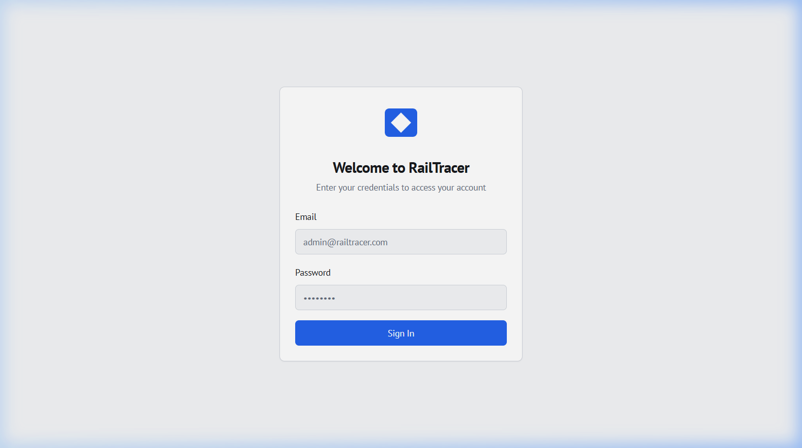
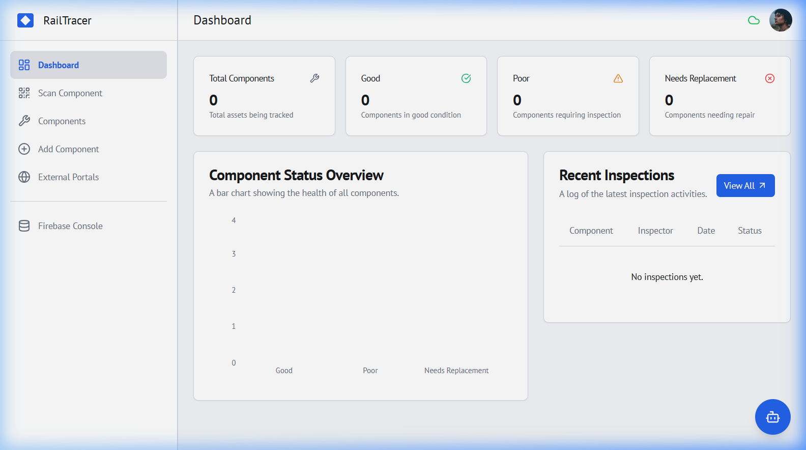
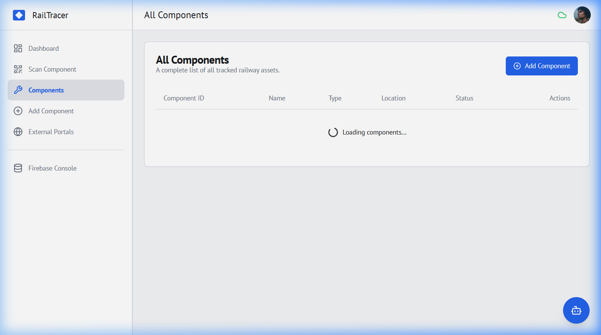

# 🛤️ RailTracer: Intelligent Railway Asset Management System

[](https://rail-tracer.vercel.app/)
[](https://nextjs.org/)
[](https://firebase.google.com/)
[](https://github.com/firebase/genkit)

**RailTracer** is an enterprise-grade Railway Asset Tracking and Inspection Management platform built with Next.js, Firebase Firestore, and Google Genkit. Designed to replace outdated paper-based logs, the application equips field inspectors and administrators with modern utilities to verify asset conditions, scan physical identifiers, and leverage multimodal AI models to diagnose material integrity in real time.

🔗 **Live Production URL:** [rail-tracer.vercel.app](https://rail-tracer.vercel.app/)

---

## 📸 Project Screenshots & User Interface

Here is a visual overview of the **RailTracer** application interface, capturing key dashboards and user portals:

### 🏠 1. Portal Entrance (Secure Login)
The gateway for both public asset tracking (via scanning) and secure administrator/technician authentication.


### 📊 2. Analytics Dashboard
A data-rich workspace displaying key metrics, component health distributions (Verified, Unverified, Damaged), and recent activities.


### ⚙️ 3. Asset Components Directory
A clean interface for technicians to view and query railway components.


---

## 🚀 Core Engineering Highlights (Recruiter Focus)

### 1. Multimodal AI Diagnostics via Google Genkit
Rather than basic LLM chat prompts, RailTracer implements isolated, schema-enforced AI agents using the Google Genkit SDK.
- **Visual Corrosion Analysis**: Using `detectMaterialStatusFlow` ([src/ai/flows/material-status-detection.ts](src/ai/flows/material-status-detection.ts)), inspectors upload component photographs. The Genkit engine passes the binary stream directly to `googleai/gemini-2.5-flash` to evaluate structural rust/corrosion and return typed analysis.
- **Genkit Structured Outputs (Zod)**: All LLM outputs are programmatically validated against strict schemas (e.g., `SuggestNextActionsOutputSchema`). This guarantees that AI recommendations strictly return a predicted JSON format containing a list of actions and the underlying logic string.

### 2. Multi-Role Content Delivery
The platform maintains strict security boundaries between public users and authenticated technicians:
- **Public View**: Accesses low-sensitivity hardware specifications and verification status by scanning the asset's QR code.
- **Inspector Portal**: Protects CRUD operations, updates logs, and runs the AI recommendation dialogs behind a secure Firebase authentication guard.

### 3. CI/CD and Cross-Platform Dev Optimizations
To support seamless development across environments and instant deployments:
- **NPM Conflict Resolution**: Configured `.npmrc` with `legacy-peer-deps=true` to handle dependencies like React 18 cleanly on Vercel's automated builds without manual flag overrides.
- **Cross-Platform Compatibility**: Modified the production build scripts in `package.json` to eliminate environment variables that crash under Windows Shell environments, ensuring identical compilation output locally and on Linux containers.

---

## 🛠️ Tech Stack

- **Core Framework**: Next.js 16 (App Router, TypeScript, Turbopack)
- **Styling & Components**: Tailwind CSS, Shadcn UI, Radix UI
- **Database & Authentication**: Firebase Firestore / Client SDK
- **AI Agent Framework**: Google Genkit & Gemini 2.5 Flash (`@genkit-ai/googleai`)
- **State & Sync**: React Context API & React Hooks

---

## 📂 Code Showcase: Structured AI Agent Flow

The following Genkit flow demonstrates how the app structures LLM reasoning to recommend specific technician actions depending on defect severity:

```typescript
// Location: src/ai/flows/inspection-suggestions.ts

const SuggestNextActionsInputSchema = z.object({
  defectSeverity: z.string().describe('The severity of the defect found during inspection.'),
  repairHistory: z.string().describe('The repair history of the component being inspected.'),
  componentType: z.string().describe('The type of the component being inspected.'),
  inspectionNotes: z.string().describe('Notes from the inspection.'),
});

const SuggestNextActionsOutputSchema = z.object({
  nextActions: z.array(z.string()).describe('Suggested next actions based on inspection data.'),
  reasoning: z.string().describe('The AI reasoning behind the suggested actions.'),
});

const suggestNextActionsFlow = ai.defineFlow(
  {
    name: 'suggestNextActionsFlow',
    inputSchema: SuggestNextActionsInputSchema,
    outputSchema: SuggestNextActionsOutputSchema,
  },
  async (input) => {
    const { output } = await prompt(input);
    return output!;
  }
);
```

---

## 🔧 Getting Started

### 📋 Prerequisites
- [Node.js](https://nodejs.org/) (v18.x or later)
- Active Google AI Studio API Key ([Gemini AI Studio](https://aistudio.google.com/))
- Firebase Console Access (Firestore configuration is already pre-configured at `src/lib/firebase.ts`)

### 🛠️ Local Installation

1. **Clone the repository:**
   ```bash
   git clone https://github.com/antony-jude/RailTracer.git
   cd RailTracer
   ```

2. **Install dependencies:**
   ```bash
   npm install
   ```

3. **Configure Environment Variables:**
   Create a `.env.local` file in the root folder and add your API key:
   ```env
   GEMINI_API_KEY=your_gemini_api_key_here
   ```

4. **Launch Developer Server:**
   ```bash
   npm run dev
   ```
   Open [http://localhost:9002](http://localhost:9002) in your browser.

---

## 📦 Compilation & Production Deployment

To compile the production build:
```bash
npm run build
```
This builds an optimized compilation bundle using Turbopack. To test the build locally, run `npm start`.

### ☁️ Vercel Deployment

RailTracer is configured for immediate hosting on **Vercel** with zero-config directory routing:
1. Connect your GitHub repository to Vercel.
2. Under project settings, leave **Root Directory** as default (`./`).
3. Add `GEMINI_API_KEY` under the Environment Variables section.
4. Click **Deploy**. Vercel will automatically build the Next.js project and deploy it.
